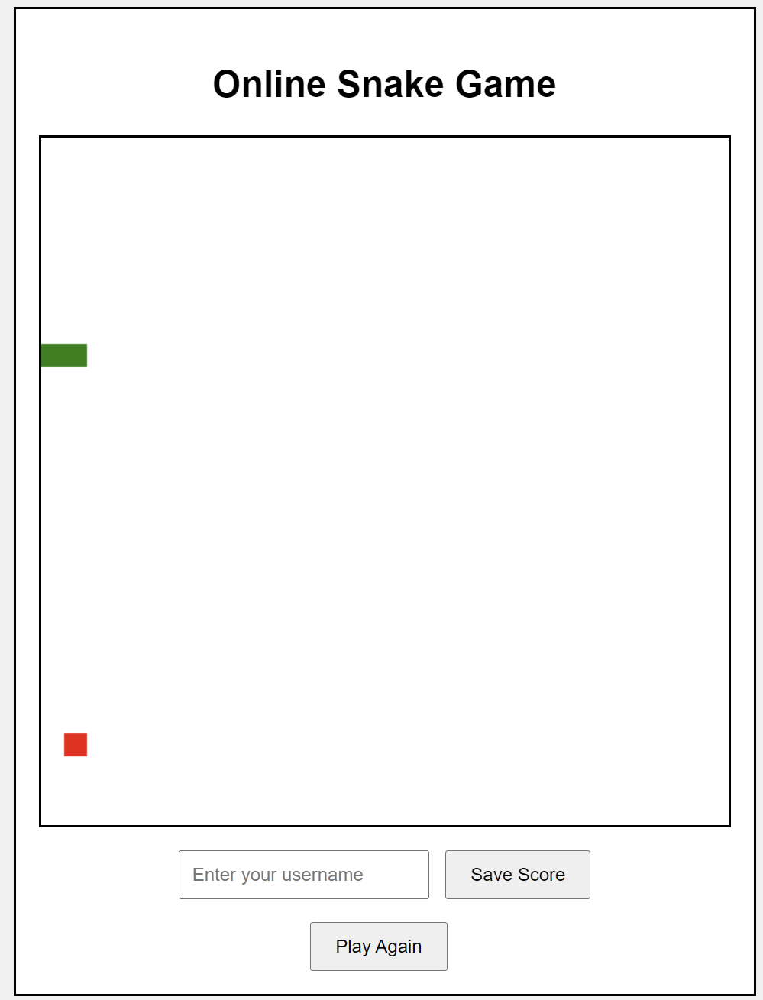

# Online Snake Game

This is an online Snake game built using Django for the backend and HTML, CSS, and JavaScript for the frontend. The game is hosted at [snake.keyneswu.top](http://snake.keyneswu.top).

## Features

- Classic Snake game mechanics.
- Score submission and leaderboard.
- "Play Again" functionality

## Installation
   
1. Clone the repository:

    ```bash
    git clone https://github.com/yourusername/online-snake-game.git
    cd online-snake-game
    ```

2. Set up the environment:

    ```bash
    python -m venv venv
    source venv/bin/activate  # On Windows, use `venv\Scripts\activate`
    pip install -r requirements.txt
    ```
   or 
   ```bash
   conda create -n snake
   conda activate snake
   conda install django
   ```
3. Apply migrations:

    ```bash
    python manage.py makemigrations
    python manage.py migrate
    ```

4. Create a superuser to access the Django admin:

    ```bash
    python manage.py createsuperuser
    ```

5. Collect static files:

    ```bash
    python manage.py collectstatic
    ```

6. Run the development server:

    ```bash
    python manage.py runserver
    ```

7. Open your web browser and navigate to `http://127.0.0.1:8000` to see the game in action.
